写在前面：如何实现企业集成，对此没有简单的答案。在我们看来，如果有人说集成很容易，这些人要么是难得的开才，要么就是少有的白痴，也有可能他们想让你相信集成很简单，以便向你兜售他们的产品而从中获得。

# 前言

本书适合以下应用开发人员和系统集成人员：

* 在设计和构建复杂的企业应用时，需要集成其他应用的应用架构师和开发人员。本书的重点在于应用的集成，而不是如何构建应用，如果想了解如何构建应用，可以看Martin Flower的书《patterns of enterprise application architecture》。

  `现在大家一提到Martin Flower，更能想起来的应该是微服务，以及约20年前由他提出的、现在很多人认为是微服务前身的领域驱动设计。`

* 为了连接已经封装或定制的应用，设计和构建集成解决的集成架构师和开发人员。

* 保持企业中软件和硬件资产”大局观“的企业架构师。

# 引言

所有的集成解决方案必须应对以下几个基本挑战：

* 网络是不可靠的。
* 网络速度慢。
* 任何两个应用都是不同的。
* 改变是难免的。

随着时间的推移，开发人员使用以下四种主要方法克服了上述挑战：

1. 文件传输。
2. 共享数据库。
3. 远程过程调用。
4. 消息传递。

本书主要介绍如何使用消息传递来集成应用。

## 什么是消息传递？

消息传递是一种能支持高速、异步、程序到程序间可靠通信的技术。程序之前通过发送数据包进行通信，这种数据包即称为消息(message)，连接程序并传递消息的逻辑路径称为通道(channel)。发送消息的应用被称为发送者(sender)或生产者(producer)，它把消息写到通道中。从通道中读取消息的应用称为接收者(receiver)或消费者(consumer)。消息本身是一种简单的数据结构——如：字符串、字节数组、记录或对象。

## 什么是消息传递系统？

消息传递能力一般是由消息传递系统来提供的，它负责协调和管理消息的发送和接收。

从本质上讲，消息传递会经过五个步骤：

1. 创建
2. 发送
3. 传输
4. 接收
5. 处理

如下图所示：

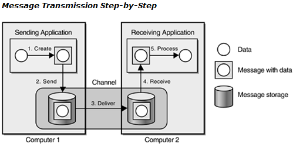

## 为何使用消息传递？

使用消息传递的特殊优点包括：

* 远程通信，消息传递允许不同的应用能够通信与传递数据。
* 平台/语言的集成，消息传递可以连接使用不同语言、技术或平台的系统。
* 异步通信，发送者不必等待接收者接收和处理消息，甚至不必等待消息传递系统传输消息。
* 可变在的定时机制，发送者可以按照自己的速度把请求批量发送给接收者，接收者也可按照自己的速度处理请求。
* 节流，接收者可以控制处理请求的速度，不会因过多的并发请求而过载。
* 可靠的通信，数据被打包成消息，它们是原子的、独立的单元。当发达者发送一个消息时，消息传递系统把消息保存起来，然后把消息传输给接收者，并再次保存。
* 无连接运行，一些发送者应用通过专门设计，能够在网络不通的情况下运行，当网络连通时再与消息者应用完成数据传输。
* 仲裁，消息传递系统在所有能够发送与接收消息的应用中扮演仲裁者的角色，如果有一个应用与其他应用断开了连接，它只需要与消息传递系统重新连接，而不必与其他所有进行消息传递的应用建立连接。
* 线程管理，一个应用在等待其他应用完成任务时，不必阻塞，调用者可以使用回调函数，通过回调获得应答消息的通知。

# 1 运用模式解决集成问题

## 为什么需要集成？

企业一般都由成百上千个应用组成，这些应用要么定制，要么由第三方获得，要么是遗留系统的一部分，也可能 是上述应用的组合，它们运行在不同操作系统平台的多个层面上。为了支持常见的商业过程和多个应用间的数据共享，必须把这些应用集成起来。应用集成必须在多个企业应用之间提供高效、可靠和安全的数据交换。

## 集成面临的挑战？

实现跨行业、跨技术的集成才是真正的挑战。

* 企业集成要求公司策略大幅调整。
* 由于集成的覆盖面很广，通常会对商业应用产生深远影响。
* 开发集成解决方案最大的限制在于，集成开发人员对所集成的各个应用只有有限的控制。
* 这个领域内的标准还很少。
* 已有的XML Web服务标准只解决了一部分集成的问题。
* 开发一个企业应用集成解决方案本身就是一项艰难的任务，运行和维护这样的解决方案可能会更加困难。

## 集成模式有何帮助？

如何实现企业集成，对此没有简单的答案。在我们看来，如果有人说集成很容易，这些人要么是难得的开才，要么就是少有的白痴，也有可能他们想让你相信集成很简单，以便向你兜售他们的产品而从中获得。

集成模式有助于填补集成的高层目标与具体系统实现之间的鸿沟。

## 集成场景

1. 信息门户——从多个数据源获取完整的数据。

   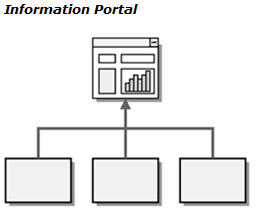

2. 数据复制

   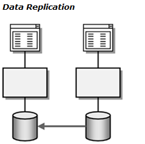

3. 共享的业务功能——将通用的数据作为函数或服务供其他系统使用。

   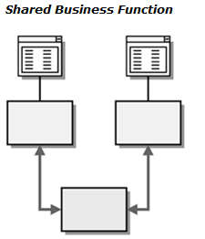

4. 面向服务的体系结构——服务是一种定义明确的功能，它对外开放并响应来自客户端的请求。

   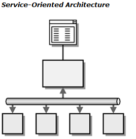

5. 分布式的业务过程——面向服务的体系结构与分布式业务之间的界限比较模糊。

   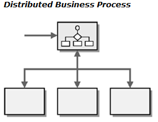

6. 企业到企业（B2B）的集成——多个企业之间的集成。

   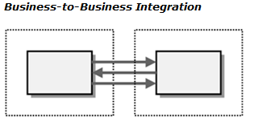

# 2 集成方式

* 文件传输——让每个应用生成共享数据文件，供其他应用使用，并使用其他应用生成的共享数据文件。
* 共享数据库——让应用把要共享的数据存储在一个公共数据库中。
* 远程过程调用——让每个应用公开提供自己的一些过程，使得其他应用能够远程访问这些过程。
* 消息传递——每个应用都连接到一个公共的消息传递系统上，并通过消息来交换数据和调用行为。

# 3 消息传递系统

* 通道——传输数据。
* 消息——通过通道传输的一个原子数据包。
* 管道和过滤器——对消息进行处理。
* 路由——决定消息如何在通道拓扑结构中进行”导航“。
* 转换——将消息从一种格式转换成另一种格式。
* 端点——消息通过一个通道传输后到达的节点。它把消息传递系统封装起来，而不让应用的其余部分了解，它为特定的应用和任务定制了通用的消息传递API。

## 消息通道

Channel 是消息系统的逻辑地址,有了channel, 发送者将消息放入channel而不用关心接收者是否已经收到该消息,这个由channel来保证.

虽然消息系统可以在某些应用运行是启动新加的channel,但其他应用则不一定能知道该新加的channel,因此我们还是建议在配置的时候来添加channel.

在具体技术实现上,开发人员可以通过代码来添加channel,比如JMS中用createQueue ; .NET 则用 new MessageQueue.

Channels虽然消耗资源比较少,但他也不是一点资源都不消耗,因此在创建成千上万这样的channels需要综合考虑各个因素以及选择适合的高扩展性的消息系统.

在使用过程中,通常对channel有两步操作:

1. 配置channel
2. 获取channel

如：J2ee的jms

配置channel: 通过j2eeadmin工具

```shell
j2eeadmin -addJmsDestination jms/mytopic topic
j2eeadmin -addJmsDestination jms/myqueue queue
```

获取channel:

```java
Context jndiContext = new InitialContext();
Queue myQueue = (Queue) jndiContext.lookup("jms/myqueue");
Topic myTopic = (Topic) jndiContext.lookup("jms/mytopic");
```

如：IBM WebSphere MQ

配置channel:通过WebSphere MQ JMS administration tool

```c
DEFINE Q(myQueue)
```

获取channel:

```c
Session session = // create the session
Queue queue = session.createQueue("myQueue");
```

## 消息

消息通常包括消息头（header）和消息体（body）两部分。

* 消息头：描述消息怎么传输,从哪里来到哪里去等信息。

* 消息体：消息的具体数据内容,通常消息系统只是传递这个数据,而不用关心具体是什么数据。

JMS Message:

在JMS中用Message 对象来表示消息，他有很多子类分别表示各种不同的消息类型，这些子类的head相同，只是body格式不同

1. TextMessage：文本消息
2. BytesMessage：字节消息
3. ObjectMessage：java对象类型消息
4. StreamMessage：java 流类型消息
5. MapMessage：body里面是java.util.Map类型的消息

.NET Message:

Message 有BodyType和body两个属性

BodyType表示当前body里面是什么类型 字符串还是字节流等

Body包含具体的数据内容

Soap Message:

遵循Soap协议标准，他也一样有header和body，如下：

```xml
<SOAP-ENV:Envelope xmlns:SOAP-ENV="http://schemas.xmlsoap.org/soap/envelope/" SOAP-ENV:encodingStyle="http://schemas.xmlsoap.org/soap/encoding/"/>
	<SOAP-ENV:Header>
        <t:Transaction xmlns:t="some-URI" SOAP-ENV:mustUnderstand="1">
            5
        </t:Transaction>
	</SOAP-ENV:Header>
	<SOAP-ENV:Body>
        <m:GetLastTradePrice xmlns:m="Some-URI">
            <symbol>DEF</symbol>
        </m:GetLastTradePrice>
	</SOAP-ENV:Body>
</SOAP-ENV:Envelope>
```

## 管道和过滤器

在许多企业集成的案例中，一个事件会触发一系列的处理步骤，每个步骤都要完成特定的功能。使用管道和过滤器结构把较大的处理任务划分为一系列较小的独立步骤（过滤器），这些步骤由管道连接。

## 消息路由器

设置不同的条件，使相应的消息经过不同的管理和过滤顺，路由本身不会修改数据，他只好把数据放到不同的目的地。路由的产生可以避免组件不断变化的过程，因此路由需要有两个特点:

1. 易修改，能及时生效
2. 路由能过很灵活，那现在流行的script语言可用于此

## 消息转换器

数据转换将一个数据的格式转换为另外一种数据的格式，可以有多个转换来构建一个转换链。数据转换有这么几层转换：

1. ***Transport：传输层***：对不同传输协议的转换，比如soap方式到jms的协议方式。具体工具和技术有Channel Adapter, EAI adapters
2. ***Data Representation： 数据表现层***：指表现出来的数据直接格式的转换，通常这个数据应该是body部分，他包括Data formats（xml格式转换等）Character sets（ASCII, UniCode）还有Encryption/compression。具体工具和技术有XML parsers, EAI parser/renderer tools, custom APIs
3. ***Data Types数据类型：***用于处理不同数据类型的转换，比如数字型到字符型，名字格式的转变，国家名称转国家代码等。具体工具和技术有EAI visual transformation editors, XSL, database lookups, custom code。
4. ***Data Structure数据结构:***处理同一块数据内不同数据间的关联关系，比如一人的地址和帐号，有三个要素account，address，customer。一个人是否可以多个地址，是否可以多个帐号等。具体工具和技术有通过结构匹配的一些模式或者通过程序代码来转换。

## 消息端点

应用和消息系统都是独立的系统，如何让应用能连接消息系统的messaging channel来进行发送和接受消息，那需要用endPoint来连接它们。

EndPoint可以自我订制，他可以接受消息也可以发送消息，但不能同时做这两件事情。

EndPonit与channel相关的，可以多个EndPoint对多个channel，也可以多个EndPoint对单个channel（通常这个是用于并发线程的操作）

在JMS中分 Producer和 Consumer，其中MessageProducer发送消息， MessageConsumer用于接收消息。

在.NET 中接受和发送消息的Endpoint都用MessageQueue。

# 4 消息传递通道

## 点对点通道

确保任何一个给定的消息只能有一个接收者接收。但并不表示只能有一个接收者，可以有多个接受者。典型的高可靠的负载均衡的应用，多个接收者，但同时只能一个接收者接收消息。另外一种应用，就是实现RPC模式，用这个Point-to-Point Channel模式,通过使用一对channels 来实现请求和返回，请求调用的是**Command Message**，返回的是**Document Message**。

In JMS, point-to-point channel实现Queue 接口. 通过 QueueSender发送消息，QueueReceiver来接收消息。

发送消息

```java
Queue queue = // obtain the queue via JNDI
QueueConnectionFactory factory = // obtain the connection factory via JNDI
QueueConnection connection = factory.createQueueConnection();
QueueSession session = connection.createQueueSession(true, Session.AUTO_ACKNOWLEDGE);
QueueSender sender = session.createSender(queue);
Message message = session.createTextMessage("The contents of the message.");
sender.send(message); 
```

接收消息

```java
Queue queue = // obtain the queue via JNDI
QueueConnectionFactory factory = // obtain the connection factory via JNDI
QueueConnection connection = factory.createQueueConnection();
QueueSession session = connection.createQueueSession(true, Session.AUTO_ACKNOWLEDGE);
QueueReceiver receiver = session.createReceiver(queue);
TextMessage message = (TextMessage) receiver.receive();
String contents = message.getText();
```

In .NET, 用MessageQueue 实现point-to-point channel功能。

```C#
//send message
MessageQueue queue = new MessageQueue("MyQueue");
queue.Send("The contents of the message.");
```

```C#
//receive message
MessageQueue queue = new MessageQueue("MyQueue");
Message message = queue.Receive();
String contents = (String) message.Body();
```

## 发布——订阅通道

如何广播一个事件给所有感兴趣的接收者。

Publish-subscribe channel可以一个input channel对应多个output channel，而每个subscribe 只有一个output channel。当一个event被发布到channel，那么Publish-subscribe channel 会拷贝多份这个event message 给output channel，没个subscribe只能处理他的message一次。正因为同时拷贝相同的信息，因此Publish-subscribe channel往往可以作为debugg 工具来监视所有的消息，而不会对现有的消息系统有任何影响。一个硬币两个面，正是这个原理，导致安全方面的问题，特别当传递的消息是money之类的敏感数据，Publish-subscribe模式很容易被窃听。

Publish不可以用通配符表示，但subscribe channel 可以使用通配符来表示来接收多个publish channels。

In JMS, a Publish-Subscribe Channel 实现Topic接口.TopicPublisher发送信息; 而每个接收者用他们自己的TopicSubscriber去接收消息。

```java
//发送消息
Topic topic = // obtain the topic via JNDI
TopicConnectionFactory factory = // obtain the connection factory via JNDI
TopicConnection connection = factory.createTopicConnection();
TopicSession session = connection.createTopicSession(true,
Session.AUTO_ACKNOWLEDGE);
TopicPublisher publisher = session.createPublisher(topic);
Message message = session.createTextMessage("The contents of the message.");
publisher.publish(message);

// 接收消息
Topic topic = // obtain the topic via JNDI
TopicConnectionFactory factory = // obtain the connection factory via JNDI
TopicConnection connection = factory.createTopicConnection();
TopicSession session = connection.createTopicSession(true,
Session.AUTO_ACKNOWLEDGE);
TopicSubscriber subscriber = session.createSubscriber(topic);
TextMessage message = (TextMessage) subscriber.receive();
String contents = message.getText();
```

## 数据类型通道

用于告知接收者当前收到的数据是什么类型，如何处理，具体类型包括array，字节，还是xml文档，还是序列化对象等，此外还包括内容的结构，比如xml对象的schema，序列化对象的class等。

前面我们说channel 虽然消耗的资源少，但是还是会消耗资源的，因此当会需要很多dataType channel的时候，我们可以考虑另外一种方式，即利用一个channel上为每个dataType设置一个**Selective Consumer**。这样就减少了开多个dataType Channel引起资源过大的问题。

## 非法消息通道

类似error 日志，当出现格式不对，无法识别等异常的消息，则接收者将这些消息转给Invalid Message Channel。需要注意的是，Invalid Message Channel接收的消息不一定是非法的消息，有些消息是合法的正常的，但可能处理的接收者不能处理，对当前的接收者来说是非法的，但对其他接收者可能就是合法的，这类消息也是会转到Invalid Message Channel中。

通常会有两种error message：

* processing errors：消息本身的错误或者消息不合法，就如上面谈的那些情况。

* application errors：消息本身合法，但是应用产生的错误，比如一个命令消息要求应用删除一条记录，但数据不存在，可能这个时候就是产生一个application error

通常这两类error都可以进入`Invaild Message Channel`，但是当接收者是**Service Activator**或**Messaging Gateway**，当是`message-processing errors`则会进入**Invaild Message Channel**，而产生`application errors`则不会做任何事情。

## 死数据通道

用于存放无法传送的消息。当消息系统不知道当前的消息传输到哪里，则就放入到Dead Letter Channel，他和Invalid Message Channel在于，接收者接收到的数据认为是非法的消息则存放到Invalid Message Channel，而Dead Letter Channel是消息系统可以放入的通道。

## 可靠传输

该含义是确保message在传递到下一地方前先进行保存在disk上，来反正传输中，系统宕机的情况。这种方式确保了消息的传递，放在消息的丢失，而这个功能，他是通过牺牲了部分性能换来的，在高交互的系统中，当使用Guaranteed Delivery后，如果忽然网络的中断，可能导致消息的堆积，这个时候我们可以通过设置retry timeout 来设置消息在系统中存储的时间。而如果消息为Event message的时候，幸运的是大部分系统支持Event message 本身基本具体失效时间。

例：JMS将消息持久化

在JMS中，可分别为每条消息设置消息的持久性。

当JMS发送者想要产生持久消息时，可使用MessageProducer并设置DeliveryMode.PERSISTENT。发送者对某条消息设置持久性的操作如下：

```java
Session session = // obtain the session
Destination destination = // obtain the destination
Message message = // create the message
MessageProducer producer = session.createProducer(destination);
producer.send(message, javax.jms.DeliveryMode.PERSISTENT,
javax.jms.Message.DEFAULT_PRIORITY, javax.jms.Message.DEFAULT_TIME_TO_LIVE);
```

如果想让所有的消息都成为持久的，可以将持久性设置为默认属性，如下：

```java
producer.setDeliveryMode(javax.jms.DeliveryMode.PERSISTENT);
```

例：IBM WebSphere MQ

```c
DEFINE Q(myQueue) PER(PERS)
DEFINE Q(myQueue) PER(APP)
```

例：.NET Persistent Messages：

```c#
MessageQueue.Create("MyQueue", true);
```

## 通道适配器

通道适配器：用于与应用相连然后将消息转到消息系统，通常他和转化器一起使用，可以认为是message client。他可以监听application的事件，然后通过这些事件调用消息系统。也可以收到消息后调用application。

这种适配器大概有三类：

1. User Interface Adapter：界面式适配：通过简单的http之类协议简单的调用能产生报表等数据之类的适配。和系统耦合小，但变化相对比较频繁。
2. Business Logic Adapter: 应用逻辑匹配：通常是基于应用暴露的api进行封装，来与message system 相连。比如EJBs，COM objects等
3. Database Adapter:数据库匹配，直接对数据库进行操作的message client。好处他能绕过应用系统，通常读取数据则没什么问题，但是如果要对数据库进行更新则会变得很危险。

有些Channel Adapter 并不是双向的，他可以获取消息然后调用application的功能，但application的变化，则Channel Adapter不能察觉。

正因为这个原因，出现了一个变种Metadata Adapter 该适配器不会调用application的功能，但是他会分析application 的metaData 从而能侦查application的变化。

此外，下面将的Messaging Bridge 也可以归为Channel Adapter，只是他比较特殊，他两头连接的不是application和messaging system，而是messaging system和messaging system。

## 消息桥

Messaging Bridge 是多个channel adapter的集合。他为两个消息系统进行搭桥。

## 消息总线

Message Bus 消息总线，适合为多个系统进行统一的消息汇总和处理，由三部分组成：

* Common communication infrastructure：基本通信地基：他说Message Bus的重要核心功能，类似pc电脑中的主板和cpu，具备核心地基功能同时又有良好的扩展性来接收其他插件。他应该包括基本的message router之类的功能。

* Adapters：就如声卡和显卡之类的插件，可以在主板上任意DIY，同样的道理，不同应用系统的需求，他们通过他们的adapter来实现和message bus的连接。他包括一般商业的或者定制的Channel adapters 和Service activators

* Common command structure：基本指令：与PC硬件指令类似，比如读内存指令之类的，在message bus 也是具备规定的一系列指令，同时这些指令需要其他的Adapter厂商或者组织能够理解和支持。Command Message描述了这个指令如何工作。

# 5 消息构造

## 命令消息

Command Message：命令（指令）消息：如何像调用RPC一样，我们可以通过消息来发出请求。这个消息就是指令消息。RPC与Command messge 的区别是RPC是同步，而Command message 是异步。

通常Command message 是在point-to-point channel 上进行发送的，这样可以保证一个命令只能被执行一次。

例子：soap协议调用接收者的GetLastTradePrice方法并带有一个参数symbol.

```xml
<SOAP-ENV:Envelope xmlns:SOAP-ENV="http://schemas.xmlsoap.org/soap/envelope/" SOAP-ENV:encodingStyle="http://schemas.xmlsoap.org/soap/encoding/">
    <SOAP-ENV:Body>
        <m:GetLastTradePrice xmlns:m="Some-URI">
            <symbol>DIS</symbol>
        </m:GetLastTradePrice>
    </SOAP-ENV:Body>
</SOAP-ENV:Envelope>
```

## 文档消息

Document Message:文档消息，该载体主要就是文档的传递，文档的内容最为重要，因此常常通过Guaranteed Delivery来保证，而event message和document message 类似具有内容和时间两个主要属性，但是时间属性在event message则更为重要。

例子： Java and XML：

```java
Destination dest = // Obtain the destination
MessageProducer sender = session.createProducer(dest);
String purchaseOrder =
"<po id=\"48881\" submitted=\"2002-04-23\">
<shipTo>
<company>Chocoholics</company>
<street>2112 North Street</street>
<city>Cary</city>
<state>NC</state>
<postalCode>27522</postalCode>
</shipTo>
<order>
<item sku=\"22211\" quantity=\"40\">
<description>Bunny, Dark Chocolate, Large<
/description>
</item>
</order>
</po>";

TextMessage message = session.createTextMessage();
message.setText(purchaseOrder);
sender.send(message);
```

上面command 调用后的soap返回，其实就应该是document message，他返回当前stock的价格：

``` xml
<SOAP-ENV:Envelope xmlns:SOAP-ENV="http://schemas.xmlsoap.org/soap/envelope/" SOAP-ENV:encodingStyle="http://schemas.xmlsoap.org/soap/encoding/"/>
<SOAP-ENV:Body>
    <m:GetLastTradePriceResponse xmlns:m="Some-URI">
        <Price>34.5</Price>
    </m:GetLastTradePriceResponse>
</SOAP-ENV:Body>
</SOAP-ENV:Envelope>
```

## 事件消息

Event Message：事件消息，该载体用于存放event事件。使事件作为消息进行传递。就如上面所说的，时间属性对event message最为重要，因为往往时间能体现event的变化，产生等特性，而内容则次之，甚至都不需要内容。对于Event message设置Message Expiration非常有帮助，而Guaranteed Delivery对event来说没有太多必要。

而当我们的价格修改的时候，其实有两种情况，一种只是告诉观察者，价格变化了，那么这个时候用event message；另外一种，除了告诉价格变化了，而且还要把最新价格提供，那么这个时候就是document message。

那么什么时候用他们两个，这里有`push model`和`pull model`

* Push model：

  一个消息包含document/event message。

  优点：只有一个消息，那么减少head之类的信息，降低传输带宽

  缺点：不论是否关心里面的document，都需要接收他，因为这两类信息都在一个消息里。

* Pull model:

  由三个消息组成：

  \<1\> Update: 一个通知观察者的event message

  \<2\> State Request: 一个请求的Command message，让观察者用于调用。

  \<3\> Sate Reply: 一个document message，传递给观察者。

  优点：因为有3个消息，因此对感兴趣的观察者，可以只接受event messge 也可以都接受。

  缺点：同样的内容，需要三个消息，信息载体变大，影响传输带宽。

## 请求/响应

Request-Reply:表达了发生消息作为请求后，如何发送者接收reply。

在这个模式中参与者有：

**Requestor:**用于发送一个请求消息，并等待回复。

**Replier:** 收到一个请求消息，并返回相应回复。

*通常 request channel 既可以是Point-to-Point Channel 或 Publish-Subscribe Channel，而reply channel 通常只是Point-to-Point Channel。*

Requestor在接收reply的时候有两种途径：

1. Synchronous Block： 同步阻塞： 只有一个线程同时进行发送request和接收reply，发送request后就一直等待reply消息的返回，因此requestor宕机时，很难重建上次的线程。
2. Asynchronous Callback：异步调用：一个线程进行发送request，而可以独立的线程进行监听reply。因此可以多个request线程来发送不同request，而共享一个单一的reply channel来接收reply。

Reply有三类返回：

1. Void： 返回无具体值，只表示request被接收并处理了
2. Result value： 返回里面有具体值，比如查询后的结果集等。
3. Exception：产生的异常。

## 返回地址

replier如何知道reply发送到什么地方？因为消息request-reply方式的传输，因此往往不能简单将reply放入channel就行，需要有一套机制来保证，reply知道发送的地方甚至对相应request的匹配。通过添加Return Address来告诉接收者把reply消息放入哪个channel。而Correlation Identifier告诉发送者哪个request是这个reply匹配的。

例子：JMS中通过设置JMSReplyTo参数

Request时：

```java
Queue requestQueue = // Specify the request destination
Queue replyQueue = // Specify the reply destination
Message requestMessage = // Create the request message
requestMessage.setJMSReplyTo(replyQueue);
MessageProducer requestSender = session.createProducer(requestQueue);
requestSender.send(requestMessage);
```

接收者返回reply：

```java
Queue requestQueue = // Specify the request destination
MessageConsumer requestReceiver = session.createConsumer(requestQueue);
Message requestMessage = requestReceiver.receive();
Message replyMessage = // Create the reply message
Destination replyQueue = requestMessage.getJMSReplyTo();
MessageProducer replySender = session.createProducer(replyQueue);
replySender.send(replyMessage);
```

## 关联标识符

上面的Return Address来告诉接收者把reply消息放入哪个channel。而Correlation Identifier告诉发送者哪个request是这个reply匹配的，他的过程是这样的：

由requestor产生的一个request id，然后放入消息的head中，接收者接收到这个消息后，将id 作为Correlation ID放在reply返回。因此ID放在head里面，并且Request ID和Correlation ID 需要是同一个类型，否则需要类型转换的告知。

对于Correlation Identifier使用有下面几种场景：

最简单场景：由某种规则自动产生request ID，然后reply中的Correlation ID与requestID 一致。

基于businessID的场景：往往很多时候到系统收到reply 时候，往往需要做相应的业务操作，那么本身业务可能也需要一个唯一号，比如order Id，那么如果直接将order id 作为request Id和Correlation Id，这样可以省去转换的功能。当然如果不用order id作为Correlation Id，那么需要有个Map来进行他们id直接的转换和匹配。

多链场景：如图

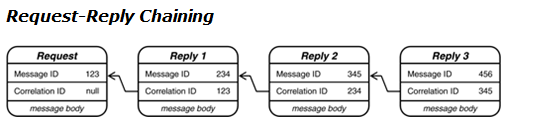

这个图描述了 什么是多链。它是指一个request产生一个reply1后，reply1转换为request后，就会产生reply2，reply3...

例一: JMS Correlation-ID Property:

```java
Message requestMessage = // Get the request message
Message replyMessage = // Create the reply message
String requestID = requestMessage.getJMSMessageID();
replyMessage.setJMSCorrelationID(requestID);
```

例二：在.NET中的 CorrelationId 属性是用到MessageQueue对象中的PeekByCorrelationId(string) and ReceiveByCorrelationId(string)来个那个方法。

例三： soap

Request:

```xml
<?xml version="1.0" ?>
<env:Envelope xmlns:env="http://www.w3.org/2002/06/soap-envelope">
    <env:Header>
        <n:MsgHeader xmlns:n="http://example.org/requestresponse">
        </n:MsgHeader><n:MessageId>uuid:09233523-345b-4351-b623-5dsf35sgs5d6</n:MessageId>
        </n:MsgHeader>
    </env:Header>
	<env:Body>
        ........
	</env:Body>
</env:Envelope>
```

Reply:

```xml
<?xml version="1.0" ?>
<env:Envelope xmlns:env="http://www.w3.org/2002/06/soap-envelope">
    <env:Header>
        <n:MsgHeader xmlns:n="http://example.org/requestresponse">
            <n:MessageId>uuid:09233523-567b-2891-b623-9dke28yod7m9</n:MessageId>
            <n:ResponseTo>uuid:09233523-345b-4351-b623-5dsf35sgs5d6</n:ResponseTo>
        </n:MsgHeader>
    </env:Header>
    <env:Body>
        ........
    </env:Body>
</env:Envelope>
```

## 消息序列

消息序列，当一个数据很大的一个包需要传递的时候，我们往往不能将这个一个数据放入到一个消息中进行传递，我们需要把大的数据切成多个小的数据，同时要保证切块后的小数据能完整呈现，那我们就用到了message sequence,下面直观描述了message sequence的结构：

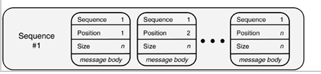

它包括三大部分：

1. Sequence identifier： 序列ID：来区分不同消息序列的
2. Position identifier：每个消息在序列中的位置信息
3. Size or End indicator：序列中消息的个数或者是否该消息为最后一个消息的标识

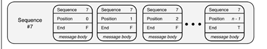

这个里面没有用size 而是用End 来处理，F表示false，表示这个消息不是最后一个，如果是T则表示是最后一个消息。

如果作为序列消息组里面的消息，如果没有相关的sequence id或者其他关键要素，则接收者会将消息作为非法消息放入Invalid Message Channel。

如果应用使用一个Transactional Client来接收和发送消息，那么表示send的消息序列在一个单一的事务中，同样接收也在一个事务中。

Message Sequence通常用于Message Channel中的单个channel，不兼容Competing Consumers or Message Dispatcher。

使用的场景有：

1. Large Document Transfer：大型文档传递

2. Multi-Item Query：多项请求查询：比如对某个作者的一系列著作进行查询。

3. Distributed Query：分布式查询：一次查询分多个地方，多个地方反馈的结果才是一个完整的内容。

4. Soap例子：

   请求：

   ```xml
   <?xml version="1.0" ?>
   <env:Envelope xmlns:env="http://www.w3.org/2002/06/soap-envelope">
       <env:Header>
           <n:MsgHeader xmlns:n="http://example.org/requestresponse">
               <n:MessageId>uuid:09233523-345b-4351-b623-5dsf35sgs5d6</n:MessageId>
           </n:MsgHeader>
       </env:Header>
       <env:Body>
           ........
       </env:Body>
   </env:Envelope>
   ```

   第一次的返回：

   ```xml
   <?xml version="1.0" ?>
   <env:Envelope xmlns:env="http://www.w3.org/2002/06/soap-envelope">
   <env:Header>
       <n:MsgHeader xmlns:n="http://example.org/requestresponse">
           <!-- MessageId will be unique for each response message -->
           <!-- ResponseTo will be constant for each response message in the sequence-->
           <n:MessageId>uuid:09233523-567b-2891-b623-9dke28yod7m9</n:MessageId>
           <n:ResponseTo>uuid:09233523-345b-4351-b623-5dsf35sgs5d6</n:ResponseTo>
       </n:MsgHeader>
       <s:Sequence xmlns:s="http://example.org/sequence">
           <s:SequenceNumber>1</s:SequenceNumber>
           <s:TotalInSequence>5</s:TotalInSequence>
       </s:Sequence>
       </env:Header>
       <env:Body>
           ........
       </env:Body>
   </env:Envelope>
   
   ```

   最后一次的返回：

   ```xml
   <?xml version="1.0" ?>
   <env:Envelope xmlns:env="http://www.w3.org/2002/06/soap-envelope">
       <env:Header>
           <n:MsgHeader xmlns:n="http://example.org/requestresponse">
               <!-- MessageId will be unique for each response message -->
               <!-- ResponseTo will be constant for each response message in the sequence-->
               <n:MessageId>uuid:40195729-sj20-pso3-1092-p20dj28rk104</n:MessageId>
               <n:ResponseTo>uuid:09233523-345b-4351-b623-5dsf35sgs5d6</n:ResponseTo>
           </n:MsgHeader>
           <s:Sequence xmlns:s="http://example.org/sequence">
               <s:SequenceNumber>5</s:SequenceNumber>
               <s:TotalInSequence>5</s:TotalInSequence>
           </s:Sequence>
       </env:Header>
       <env:Body>
           ........
       </env:Body>
   </env:Envelope>
   ```

## 消息过期

消息失效，可以为消息设置失效属性，messaging system在接收到已经失效的消息可以丢弃它也可以把它放入Dead Letter Channel。此外因为时区问题导致时间不一致，通常消息系统负责来统一调整成一类时间进行比较。如果是接收者接到到失效的消息，则会放入到Invalid Message Channel。

如图：

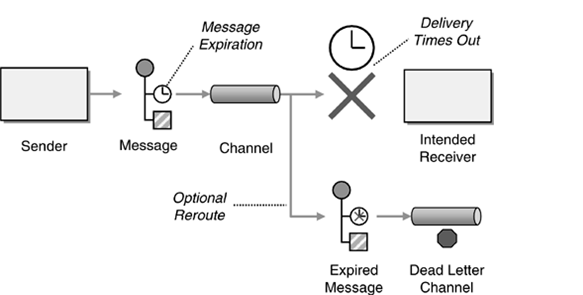

在Publish-Subscribe Channel模式中：因为消息是进行了拷贝，因此一个接收者收到的消息认为是过期了，则不会影响其他接收者的判断。

在request-reply模式中：将reply消息设置Message Expiration 是没有什么意义的，因为send总希望知道request是否第一时间达到。

例子一：JMS

对某个消息设置：

```Message.setJMSExpiration(long)```

对所有消息设置：

```MessageProducer.setTimeToLive(long)```

在发送时候设置：

```MessageProducer.send(Message message, int deliveryMode, int priority, long timeToLive)```

例子二：.NET 两个参数

TimeToBeReceived和TimeToReachQueue：

## 格式指示符

格式指令：对格式的描述通常有三部分内容：

1. Version Number：版本号 例如\<?xml version=\"1.0\"?\> 其中1.0就是版本号

2. Foreign Key 外键 只具体格式描述的ID，可以URL，Document名字，例如\<!DOCTYPE greeting SYSTEM \"hello.dtd\"\>，这里本地hello.dtd 表示

3. Format Document：具体格式文档，比如hello.dtd内容：

   ```dtd
   <!DOCTYPE greeting 
       [
           <!ELEMENT greeting (#PCDATA)>
       ]
   >
   ```

# 7 消息路由

## 引言

消息路由模式可以划分为以下三类：

* Simple router：简单路由，这是消息路由的变种，它把消息从一个入站通道路由到一个或多个出站通道。有下面几种类型：

  

  这里不包括 Dynamic Router，因为任何router都可以实现Dynamic Router。

* Composed Routers：组合的路由，它由上面的简单路由组成。

* Architectural Patterns：架构模式，基于上面两种的router来组织，描述了基于消息路由的架构风格。


总体树图：

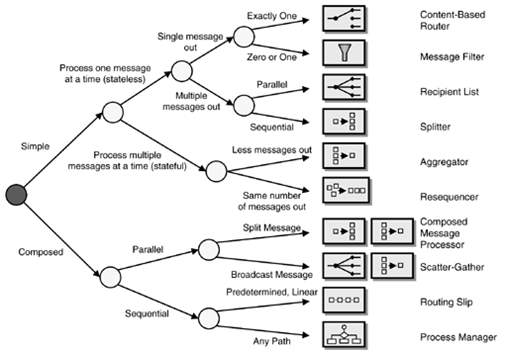

## 基于内容的路由

基于内容的路由，当一个消息进入Content-based Router，则直接通过分析content来分出Widgets和Gadgets。

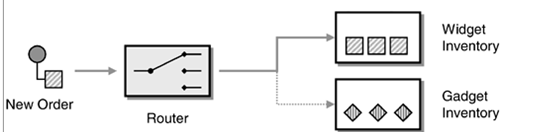


## 消息过滤器

通过将消息分发为两份，通过两个不同的filter来分出Widgets和Gadgets

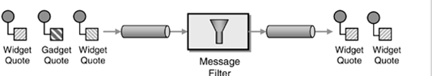

> Tips: 下面列出两种模式的区别
>
> | 基于内容路由模式                                           | 基于过滤模式                                 |
> | ---------------------------------------------------------- | -------------------------------------------- |
> | 一个接收者接收一个消息                                     | 多个接收者可以接收一个消息                   |
> | 中心控制，预先路由                                         | 分布式控制，被动过滤                         |
> | 路由需要知道参与者，当参与者增加或减少后，路由需要相应更新 | 不需要知道参与者，参与者的增加删除，非常简单 |
> | 通常用作业务上的处理，如订单                               | 通常用作事件通知或者纯粹消息                 |
> | 通常与queue-based   channels一起使用                       | 通常与publish-subscribe   channels一起使用   |
>
> 上面具体使用哪种模式，可以从两个方面考虑：
>
> 1. 具体业务的需要：如需要分布式的数据，则可能用过滤模式；当内容敏感时，则尽量基于内容路由，减少外泄给其他人知道。
> 2. 网络交换的情况：可以更加当前具备的网络情况来采用不同模式，当网络本身分布式，则可以通过分布式来减轻压力；如果目前接收者都在单机，则使用集中模式就可以了。

## 动态路由

与message filter不一样，message filter 处理所有的消息，也就是说所有的消息都要同样的拷贝多份，而动态路由的原理如下：

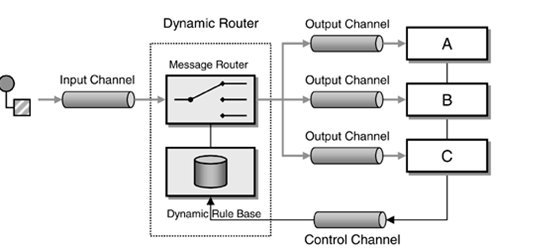

从图中可以看出，Dynamic Router除了有Input Channel 和Output Channel 外还有个特殊的Control Channel，当系统启动时，接收者将通过Control Channel 向Dynamic Router 发一个特殊的信息，来告知他们能接受到的消息的规则，这些规则放入到Rule Base，当发生者发生了一条信息后，Dynamic Router 通过查找规则库的规则还确定发生到哪个接收者。那么如果启动时候失败，怎么办？，那通常通过Pulish-subscribe channel，Dynamic Router 广播给所有接收者，接收者通过control channel给出反馈。

因为，接收者之间是相互独立的，因此不能排除他们之间规则的冲突，如果发生冲突，Dynamic Router 通过下面3种策略来解决：

1. 规则忽略：忽略冲突的规则信息，当在规则库里面有的规则，这时新来的会冲突的规则则就忽略掉。但是如果所有接收者同时发生规则，那么冲突的话的行为就很难预料了。
2. 单个匹配：规则库不规避冲突的规则信息，只是当一个信息过来后，进行所谓第一个匹配，找个第一个匹配的信息进行路由，接来的匹配不关心。
3. 多个匹配：将信息拷贝多份，只要符合规则的都匹配，这种类似于message filter。

应用场景：

一种可以用于IP路由的场景中，另外一种可以用于SOA架构中，Rule Base存放所有service的URL，通过Dynamic Router 来分发到不同service。

## 接收者列表

接收者列表，就如发生一个邮件给多个人一样，他表示将一个消息发送给多个人。如图描述了接收者列表的模型。

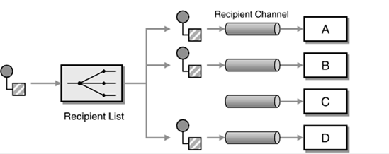

如上图所示,为每个接收者定义一个channel，Recipient List 将相应的信息发送给指定的接收者。那么这些接收者的信息怎么来的？ 有两种方法：

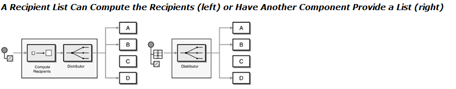

一种本身接收者的具体名单在接收者列表里面；另外一种接收者的具体名单类似于邮件一样，在发送的消息上添加了。通常为了不让接收者自己能知道哪些人也接受了这个消息，通常接收者列表发送的消息会去掉消息中带有的接收者的具体信息。

### 健壮性

因为接收者列表需要把一个消息发送给多个接收者，因此如果保证在传输时，接收者列表出现故障或者宕机后，信息还能完整的传递。（这里所说的每个接收的消息是最小的原子单位）可以有三种方法：

1. Single transaction：事务化：将消息都放到每个output channel，但是只有在全部放入完成后才能提交。
2. Persistent recipient list：持久化：接收者列表可以记住所有已经发送的消息，当系统宕机后，他能找到相应的消息发送给其他未收到的接收者。
3. Idempotent receivers：幂等化：要求接收者是幂等的，所谓幂等就是，接收者可以重复接收同一消息，而接收后对系统的影响和只接收一次消息一样。

### Dynamic Recipient List

在Recipient List 上面加上一个Control channel，这样接收者通过control channel告知Recipient List 他是接收者的一员。

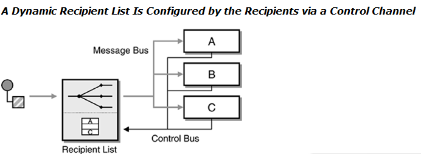

Recipient List 和Publish-Subscribe and Filters对比：

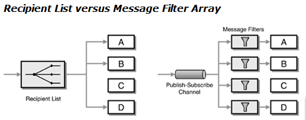

| Recipient List                                               | Publish-Subscribe   Channel with Message Filters |
| ------------------------------------------------------------ | ------------------------------------------------ |
| 中心控制，预先路由                                           | 分布控制，被动路由                               |
| 路由需要知道接收者，接收者的增删，路由需要被更新。如果使用dynamic router 需要用到control channel | 不需要关心接收者，增删接收者更为容易             |
| 通常用于业务信息操作中                                       | 通常用于事件通知或者纯信息消息                   |
| 基于队列的情况下，这种模式更有效                             | 当使用publish-subscribe channel 时，性能上更有效 |

## 消息拆分

当一个消息里面包含多个item，而且多个item需要分给不同的系统处理，则这个时候需要用到Splitter。


原始消息有两个数据结构：

1. 树状信息：需分拆的信息是树状信息。这个时候splitter需要遍历树，进行分解：

   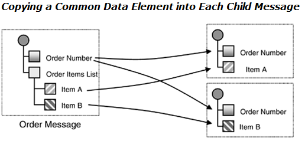

   需要把common的信息，在每个分解或的信息中都拷贝一份。

2. 顺序信息：需拆分的信息简单的将可分解的信息一个个顺序相连。

   

   此外对分拆后的信息和大信息之间本身是有这么一个源头的关系，如果照上面分解后，那么分解后的信息很难追溯到分解前的大数据，因此在每个分解后的信息中加上分解前的大信息的ID就能解决这个问题。

## 消息聚合

所谓聚合就是将相关的消息聚合成一个消息发出，如图：

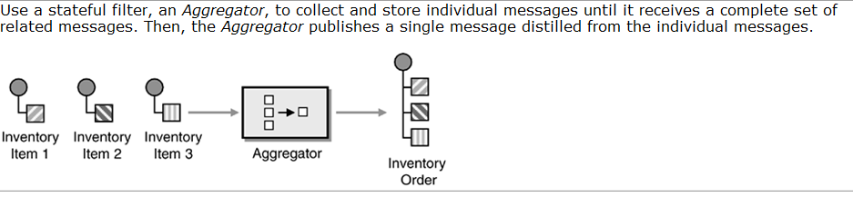

Aggregator 也以往的组件不同，他是stateful的组件，因此他需要解决下面三方面的问题：

Correlation：需要知道哪些消息是需要聚合的消息，通过Correlation来体现。

Completeness Condition：完成条件指表示当前聚合的条件已经具备，可以聚合为一个消息并发送给output channel。

Aggregation Algorithm：需要知道聚合后的消息中各消息的结构关系。

Aggregator 原理：

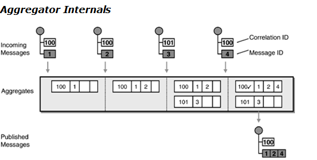

上图可以看出，Aggregator 通过message里面的CorrelationID和MessageID将消息将相同的CorrelationID的消息放入到一个Aggregate中进行聚合，当这个Aggregate知道完成条件已经具备后，则把这个Aggregate标记为完成，然后放入到output channel中。

聚合条件触发的策略：

1. Wait for All：等待所有的消息到齐后才开始聚合。这种方式往往用在聚合的消息要求很全面，缺点效率低，而且中间某个消息的问题就阻扰了后续的工作。比如订单这类。
2. Timeout：超时后就聚合，比如股票的竞标价格。
3. First Best：收到第一个（最快的）就聚合。
4. Timeout with Override：在规定时间内收到预先设置的消息后，就聚合。
5. External Event：外部的事件触发聚合动作。

聚合数据内容结果的3种情况：

1. Select the \"best\" answer:找出最好的消息作为聚合后的输出，比如在一堆竞标价格中找到最低的作为输出。
2. Condense data:压缩数据：比如将多个数据的订单价格作为平均数计算后进行输出。
3. Collect data for later evaluation:简单的将数据拼装为一个消息，具体处理有后续的组件处理。

在上面的聚合触发条件，当是timeout策略的时候，这个timeout可以认为是一个参数；而在 wait for all策略的时候，他需要一个重要的参数是有多少消息能聚合成一个参数，通常这个参数可以在aggregator上配置；可以在每个消息上都加上这么一个数字参数，这里我们在下图设置了另外一种模式：

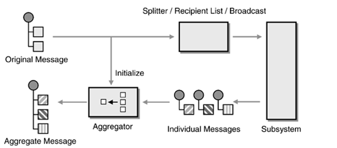

上面可以看出，原始的数据在初始化的时候给Aggregator已经发送了，那么这个原始信息的submessage 个数也就知道了。

例一：用Aggregator作为系统检查器

下图是Joe Walnes设计出的用Aggregator 作为系统检查器

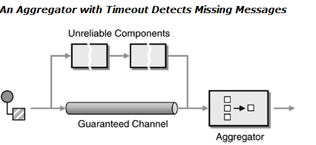

如上图所示，Unreliable Components 是不可靠的组件或系统，当消息过来分别走这两个channel，然后在Aggregator汇合。Aggregator 采用\"Timeout with Override\"策略，在规定时间内收到两个同样消息意味着，系统正常；若出现超时，则意味着有一个消息没有产生，那说明系统宕机或者异常了。

## 消息重排

Resequencer是一个stateful filter，它接收一系统消息，当接收到一系列消息已经完成后，Resequencer则开始对接收到的消息进行排序，然后将消息发送给下方，Resequencer通常不会改变消息的内容。

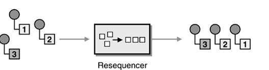

排队大家都会知道需要有个序号，序号有别与MessageId 和CorrelationID，这两个信息首先可以数字也可以字符，而序号通常数字会更有效。此外他们的产生也会不一样，序号通常可能是分布环境的统筹安排，因此他需要消耗的资源会更多；而MessageId 和CorrelationID可以本系统简单地按照某种规则产生。

排序过程：

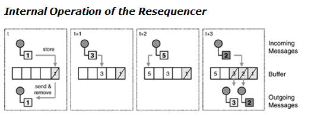

上图有1，2，3，5四个消息，假设排序从1开始，当1到的时候，则发送出去并在buffer中删除，接下来3达到时候，发现他最近的下家还没有过来，则保存在buffer中，同样接下来5，2过来，当2过来后，2发现下家已经moved，则也发送并删除，此时3发现下家2也moved，则3也发送并删除。

从上面可以看出，Resquencer需要有buffer，大家都知道，buffer是有大小的，如果避免buffer overflow呢？

这里有两类方式：

1. 应答方式：所谓应答式，就是Resequencer会将buffer中现在有的有限空位告知SendBuffer，发送者通过这个信息来决定发送多少数据，这种准确但是相当效率低。

   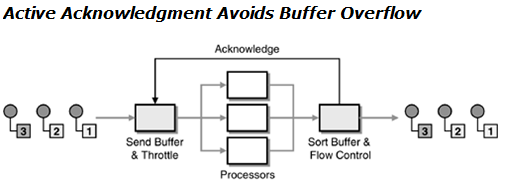

2. 替补方式：buffer来自我控制，通过自己在一定条件下，补充剩余的buffer位置，将这个消息发送出去，这个情况可能有有部分消息丢失，但是他数据传输效率高，类似于视频音频之类的传输。

## 复合消息处理

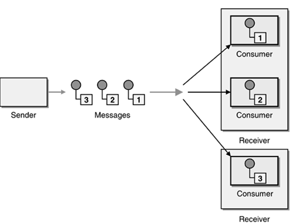

多种处理器组合的一个结果，它是将一个消息的分解成多个消息，经过不同处理后再合为一个消息。上图可以归类为下图的描述：

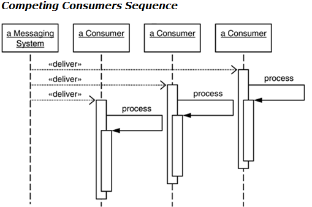

## 消息聚集

将一个消息分发给不同的接收者进行处理，然后将处理后的不同结果聚合为一个消息。

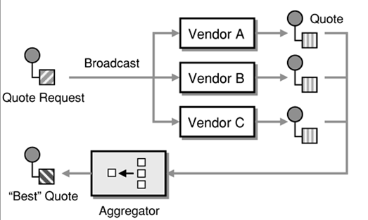

他和Composed Message Processor的共同特点都是通过Aggregator来聚合成一个结果消息，下图是他们两个模式结合的一种样例：

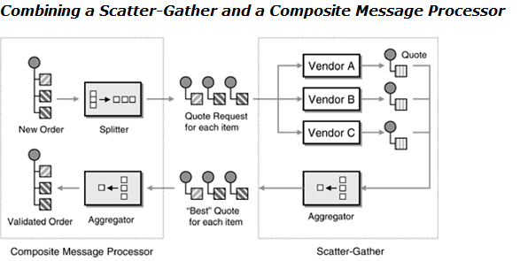

## 路由表

路由表是一个中央路由，当消息经过他时，他会给消息带上Routing Slip Message,然后消息根据这个message来分别进入需要处理的组件。

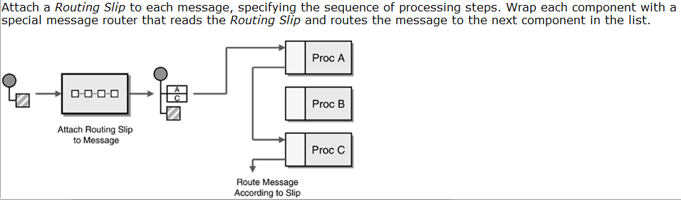

从上面可以看出，Routing Slip 非常方便灵活地进行一系列操作，但他也有下面两个局限：

1. 消息经过Routing Slip后会被增加了消息额外数据，本身消息会略微变大。此外消息每次处理的结果状态都附加在这个消息上，如果消息丢失则所有的状态也就丢失。防止消息状态的丢失，则可以使用一个中央模块处理所有的状态。
2. Routing Slip message如果产生，则这个消息一系列的路由就固定了，如果在执行过程中需要变化，则Routing Slip方式就不适合了。

适用场景：

1. 一系列的验证。比如用户的验证，而且对于一系列验证中的任何模块只有通过不通过的开关选择，若验证模块会有多于2个路由，则不适合用他。
2. 一系列的无状态的转换。比如加密解密，各种类型之间的转换。
3. 一系列数据收集工作。比如当一个人的所有信息，可能通过不同的姓名组件，地址组件，工作经历组件等，没经过一个组件，在现有的信息上进行添加，最后能形成需要的完全信息。需要注意的是：这个动作只是纯粹添加，没有任何加工的动作。

## 过程管理

路由表所处的一系列路由是预先定义的并且是线性的，那么如果要处理并行的情况，那就需要用到过程管理器。

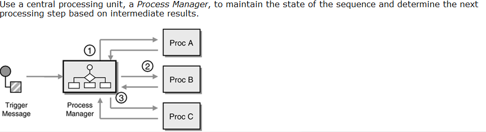

从图上可以看出，Process manager 是一个中心处理器，他将消息传给procA然后获取procA的反馈后，再把消息给ProB，一样的处理，直到所有的处理。

而那个中心处理器就是Process manager。所以一个很好的例子就是管理所有的状态。

此外，process manager 和工作流中的process manager 类似，他可以定义一个define但是同时可以有多个process 实例执行。

如图下面的例子：

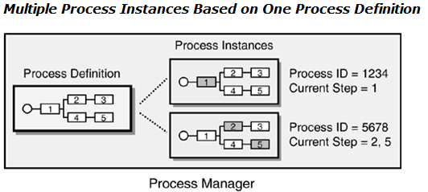

具有会出现多个实例，那么process 实例都包含process id来区分process instance。

Process Manager 和其他模式的比较：

| Distributed Pipes and Filters | Routing Slip                     | central Process Manager           |
| ----------------------------- | -------------------------------- | --------------------------------- |
| 支持复杂的消息路由流设计      | 只支持单一的线性的消息路由流设计 | 支持复杂的消息路由流设计          |
| 改变消息路由流设计简单困难    | 改变消息路由流设计简单           | 改变消息路由流设计简单            |
| 没有故障中心点                | 中心只是分配路由信息             | 能获取任何故障                    |
| 性能高                        | 性能距中                         | Hub-and-spoke模式在性能上会有瓶颈 |

## 消息代理

承担系统之间的传输，可以认为是独立的消息中介。

传统的系统图：

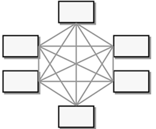

使用了Message Broker图：

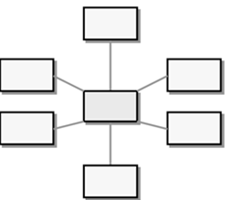

更为复杂的图：


从上图可以看出，Message Broke的优点减少了系统之间的交互，从而减少了系统间的复杂度。反过来的问题就是增加了Message Broke的压力，往往Message Broker会成为整个系统体系的瓶颈所在。

# 8 消息转换

## 信息包装器

信封：为信息添加相应需要的信封，如加密解密。


这是一类信息需转换的。

基于上面的简单的信封的多信封嵌套的：

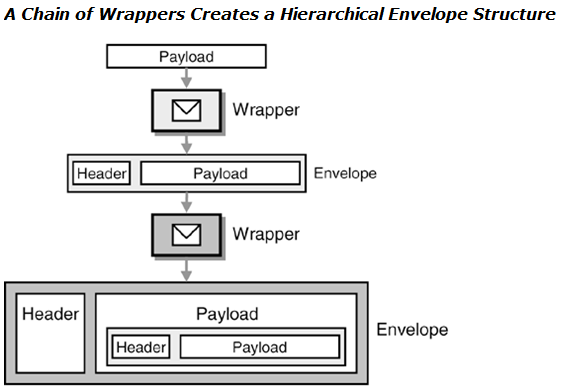

例一：soap格式

```xml
<env:Envelope xmlns:env="http://www.w3.org/2001/06/soap-envelope">
    <env:Header env:actor="http://example.org/xmlsec/Bob">
        <n:forward xmlns:n="http://example.org/xmlsec/forwarding">
            <n:window>120</n:window>
        </n:forward>
    </env:Header>
    <env:Body>
        <env:Envelope xmlns:env="http://www.w3.org/2001/06/soap-envelope">
            <env:Header env:actor="http://example.org/xmlsec/Alice"/>
            <env:Body>
                <secret xmlns="http://example.org/xmlsec/message">
                    The black squirrel rises at dawn
                </secret>
            </env:Body>
        </env:Envelope>
    </env:Body>
</env:Envelope>
```

例二：TCP/IP

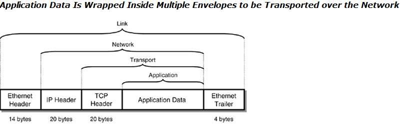

Application data 先加上TCP Header 信封,然后在上面加上IP Header信封,最后加上Ethemet 信封.

## 内容扩充器

所谓内容放大器就是通过转换将原来的信息的关联内容进行扩大，比如知道order Id,那么经过转换获取order的所有信息。下来以医院一个看病过程为例子：

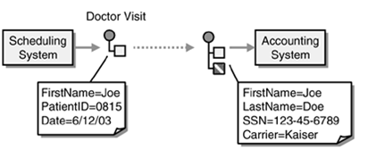

医生在scheduling system 系统只看到FirstName 之类的系统，当某个医生开完相关药品后，消息传递到accouting system,这个时候accouting system 得到了他需要的LastName，SSN等信息。那么这些信息哪里来的？这些信息本身是在Customer Care库里面，那通过什么方式能获取呢？

下来我们给出了3种方法：

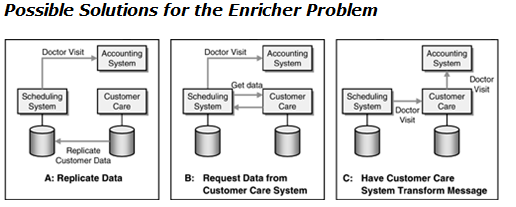

1. 同步数据: 将Customer Care的社保相关信息同步到Scheduling System中。
2. 主动请求Customer Care：当生成信息时，Scheduling System主动去Customer Care 系统去取相关数据。
3. 传递数据：将scheduling system产生的信息传递给customer care 然后将消息相关的社保信息也带出，然后进入accounting system。

因此，内容放大器具体的描述可以看图：

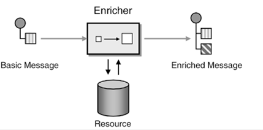

所谓的放大的信息，他来源这么几个方面：

1. 自我计算：自己计算的一些信息，比如message size，原先的message 没有，通过信息放大器后得到这个messgae size属性。
2. 当前环境：某些信息通过当前环境获取，比如time stamp，当经过内容放大器获取相关环境下的时间戳。
3. 外部系统：这个比较常用，就是纯粹的其他数据系统。

此外内容放大器和resource的连接，通常效率比耦合度更重要，因此他们的连接通常是同步的方式。

在引入内容放大器后，上面例子的流程我们可以改为：

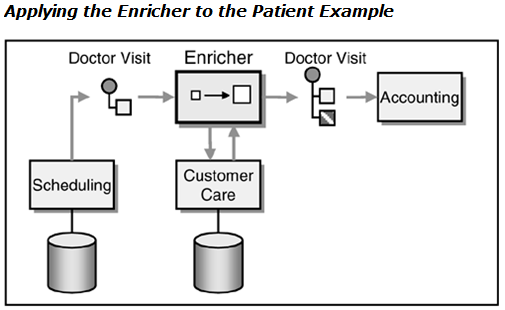

例子：和content filter一起使用的例子

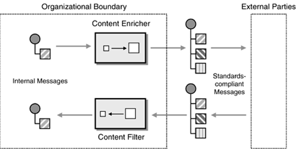

## 内容过滤器

contentFilter和上面的content Enricher正好相反，他是过滤一些信息，其原因包括（1） 为了安全，过滤敏感方面的信息 （2） 为节约网络带宽，过滤暂时不需要的信息。

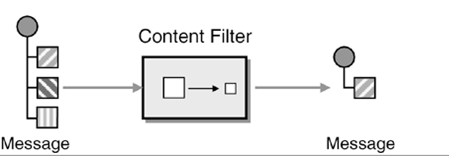

例一：

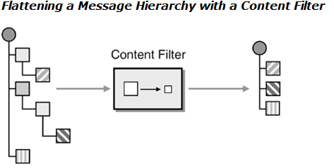

例二：

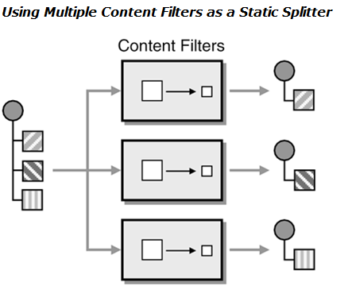

## 存放器

上面的既有信息增加也有信息减少，那么如果需要临时移除部分信息，然后未来需要找回移除的信息。因为这种需求就产生了Claim Check。

下图描述了这个例子:

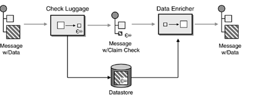

1. Message产生
2. Check Luggage 组件将大数据的那块生成一个key，并将数据保存下来。
3. Check Luggage 将原来的消息变为带key的消息，消息大大减小，并将这个消息进行传输
4. 消息到了Data Enricher 后，通过key去datastore还原原来的数据。

Key的选择：

1. Business key： 把业务上的key作为Claim Check中的key
2. Message id：将message 的Id作为key（不建议使用）
3. Unique ID: 独立的key

Key对应的数据，可以直接保存，也可以临时保存；当临时保存，则可以通过读完之后就删除或者设置过期时间来设置。

例一：当消息传递给外部系统，屏蔽敏感数据

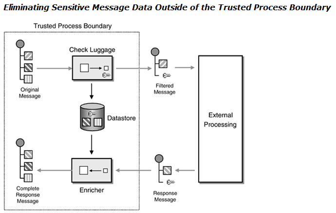

例二：在Process Manager上使用Claim Check

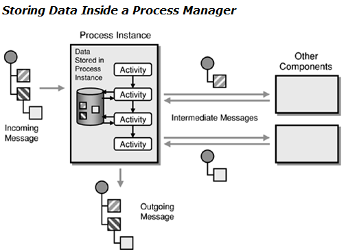

在process manager里面，每个process instance 只需要关心原始信息中的部分，因此通过Claim check来处理。

## 规范器

将所有的格式转换为统一的格式

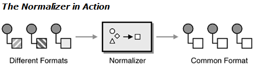

## 典型数据模型

在传统的系统间交互，如图：


系统之间通常通过为每个应用配置一个转换器，当这类消息发生变化，则所有的转换器都要发生变化，因此比较费尽。


我们通过定义通用的消息格式来解决系统之间交互，这类适合通用的，用于系统间交互的系统；而对于基于应用的业务消息则不适用这个模型。

下面有3中选择来转换成统一模型：

1. Change the applications\' internal data format：修改应用的内部格式到统一格式，此外也可以直接用共享数据库方式更为方便。
2. Implement a Messaging Mapper inside the application：通过Messaging Mapper来交换格式
3. Use an external Message Translator：使用额外的Message Translator来将应用的格式转为统一的格式，这类通常适用没有源代码的应用。

# 10 消息传递端点

## 消息网关

封装了与消息交换的接口，应用的剩余部分不需要关心消息相关的代码，只要通过调用相关方法即可。如图：


通过gateway将应用和消息系统进行分开。

Gateway通过模式分为：

* 同步式GateWay（阻塞）

  

* 异步式GateWay（事件驱动）

  

  事件驱动型Gateway向应用系统暴露异步，当应用向Gateway发送一个请求消息，同时他会提供给Gateway一个callback的要求，然后应用就开始去做他自己的其他任务，Gateway获得消息系统给出的reply后，Gateway通过callback应用系统完成整个过程。

Chaining Gateway： 某些时候为了系统的灵活，仅仅一个Gateway是不够的，需要拆分成多个Gateway 形成Gateway chain。如图：


处理消息异常：

为了使应用保持独立，因此刚发生消息级的异常，需要Gateway来捕获然后转换为应用级别的异常抛给应用。

此外Gateway还可以作为测试工具，通过在大型系统中，如何模块测试？通过简单实现GateWay的mock 就能实现测试功能。


## 消息传递映射器

从字面意思可以理解,Messaging Mapper 是对Messaging的映射，一端是Messaging，而另一端则是应用中的Business object。特别是现在面向对象方式的编程模式，应用端的操作基本是面向对象方式的，因此这种Mapper可以简化他们之间的操作，使代码耦合更小。


如何理解Mapper和Translator的不同，我们通过下面的图来理解：


上面的图可以看出，Translator是消息间的转换，而Mapper本身是作为应用的一部分，此外他是将消息转换为应用中的Domain Objects。

## 事务性客户端

如何控制应用与消息系统之间事务？这里引入了Transactional Client。通常单一的消息，即发送和接收者都是同一消息，则事务相对容易，然后消息系统复杂就复杂在会可能是多个消息，有如下场景需要用到事务：

1. Send-Receive Message Pairs：发送一个消息，接收另外一个。

   描述: 启动一个事务， 接收者接收到第一个消息后进行处理，然后将第二个消息返回出去，最好commit。

   因此可以看出，这个是使用在接收端的事务，如果用在发送端，则永远无法发送消息，因为对发送者来说，如果不commit就不会真正的发送出消息。

2. Message Groups：发送或者接收一组相关的消息。

   描述：启动一个事务，发送或接受一组消息，然后commit。

   因此在commit之前，这一组消息中任何消息都不会从channel中删除或添加。

3. Message/Database Coordination：消息和数据库协同，比如发送方发送消息则同时对数据库进行操作。

   描述：启动一个事务，接收一个消息然后更新数据库，最后commit；或者更新了数据库，然后发送一个消息，最后commit。

   因为数据库和message system都有各自的事务，因此这类事务是分布式的事务。

   另外的解读就是：在数据库没完成更新前，消息不被删除；消息没有发送，则数据库更改无效。

4. Message/Workflow Coordination：消息和工作流协同，比如消息发送后启动相应工作，结束后发出反馈消息。

   描述：启动一个事务，获得工作项，发送出请求消息，最后commit；或者启动一个事务，接收到回执消息，完成或者终止工作项，最后commit。

   另外的解读是：发送请求失败，则工作项工作也回滚；或者知道工作项完成，回执消息才删除。

   下图Transactional Client例子：

   

   发送者和接收者都能进行事务化，对于发送者，在没有commit事务的时候，消息不会被真正地加入到channel中；对于接收者，在没有commit事务的时候，消息不会被真正从channel中移除。

   下图描述一个时序图的例子：

   

   JMS例子：

   创建：

   ```java
   Connection connection = // Get the connection
   Session session =
   connection.createSession(true, Session.AUTO_ACKNOWLEDGE);
   ```

   接收消息：

   ```java
   Queue queue = // Get the queue
   MessageConsumer consumer = session.createConsumer(queue);
   Message message = consumer.receive();
   ```

   提交：

   ```java
   session.commit();
   ```

## 轮询消费者

应用如何消费消息？一种方式就是消息到达后就直接给应用消费。另一种则是应用自己主动去找消息来消费，这种就叫Polling Consumer。

Polling Consumer的好处在于他是主动行为，因此他可以自我控制自己的处理速度。


## 事件驱动消费者

当channel中为空，Polling Consumer仍然会阻塞式的等待，直到接收到消息。他的好处是能自我控制处理速度，缺点则是会出现资源的浪费，特别是channel中没有消息的这类情况。而Event-Driven Consumer则解决这种问题，他是当消息到达后，引发事件进行接收消息并处理。


这是一个异步的接收器，当消息达到时，consumer通过callback 应用来实现消息的传递。 因为consumer需要callback应用，因此consumer需要实现应用定义的回调规范，consumer包括两部分:

1. 初始化：consumer的初始化工作，当启动后，则consumer一直着准备接收消息。
2. 消费行为：只为每个到来消息执行一次消费。


应用创建定制后的consumer后，通过初始化来启动他，当没有消息到来时，consumer则变为休眠状态，consumer每次只能接收一个消息，因此消息系统不能通过并发来传递多个消息给一个consumer。

例子：JMS

Java开发者都知道，说到事件，那么消费者都需要通过监听器来监听事件。

在 JMS中, 一个Event-Driven Consumer就是实现MessageListener：

```java
public class MyEventDrivenConsumer implements MessageListener {
    public void onMessage(Message message) {
        // Process the message
    }
}
```

初始化：

```java
Destination destination = // Get the destination
Session session = // Create the session
MessageConsumer consumer = session.createConsumer(destination);
MessageListener listener = new MyEventDrivenConsumer();
consumer.setMessageListener(listener);
```

消费行为：

 当消息到达时候，通过调用 MyEventDrivenConsumer.onMessage来传递消息。

## 竞争消费者

能够并行处理消息的client，可以解决因为要处理多消息造成的瓶颈。

下图很好的说明了这个问题：


上图在一个通道上有多个消息，而在应用段着有个3个consumer，他们是并行处理所过来的消息。这里是每个consumer处理一个不同的消息，至于说出来不同的消息还是相同的消息，这个依赖于channel是Point-to-Point Channel还是Publish-Subscribe Channel。

这3个consumer就叫Competing Consumers。


## 消息分发器

前面Competing Consumers只是用来并行处理消息，增强消息处理的能力，而Message Dispatcher可以进行有规则的将某些消息分给A,某些消息分给B

如图：


他分两部分组成：

1. Dispatcher：用来调动消息，来确定将什么消息发给那个performer。
2. Performer：处理消息

Message Dispatcher 的时序图：


## 选择性消费者

到所有消息都到达消费者，消费者可以有选择性地进行消费。


时序图：


并发方式：


## 持续订阅者

在Point-to-Point Channel，可以通过Guaranteed Delivery来保证消息被送达；而对于Publish-Subscribe Channel如何保证？

这里就是引入Durable Subscriber，Durable Subscriber可以要求消息系统保存消息，即使Durable Subscriber临时断开。Non-Durable Subscriber则消息系统不会保存。


时序图：


作为Durable Subscriber，需要向Messaging system 发起订阅，完成订阅后，如果这个时候断开连接，当publisher发布消息时，则messaging system会保存消息，在Subscriber重新发起resubscribe后再发给他。而如果是Non-Durable subscriber 则消息会丢失。但是如果不需要messaging system保存消息，则可以发送unsubscribe给messaging system。

例一：股票交易

股票交易系统，他需要把价格分别发给GUI显示以及数据库。GUI则只要显示当前信息，即使丢失消息，GUI也无关紧要，因此GUI可以用Non-Durable subscriber；而数据库则必须保证能收到所有消息，因此数据库可以用Durable Subscriber。

例二：JMS Durable Subscription

TopicSubscribers支持 Durable Subscription，对于Durable Subscription区分是旧的还是新的，则依赖三个要素：

1. The topic being subscribed to
2. The connection\'s client ID
3. The subscriber\'s subscription name

因此即使在新的应用中创建新的Durable Subscription，如果上面三个参数相同，消息系统是无法区分的。

创建:

```java
ConnectionFactory factory = // obtain the factory
// the factory has the client ID
Connection connection = factory.createConnection();
// the connection has the same client ID as the factory
Topic topic = // obtain the topic
String clientID = connection.getClientID(); // just in case you're curious
String subscriptionName = "subscriber1"; // some UID for the subscription
Session session = connection.createSession(false, Session.AUTO_ACKNOWLEDGE);
TopicSubscriber subscriber =session.createDurableSubscriber(topic, subscriptionName);
```

关闭:

```
subscriber.close();
```

取消订阅:

```java
subscriber.close();
// subscriber is now inactive, messages will be saved
session.unsubscribe(subscriptionName);
// subscription is removed
```

## 幂等接收者

所谓幂等接收器指无论对同一个消息收到多少次，其影响是一样的。

## 服务激活器

Service Activator扮演可被消息方式调用或是其他方式调用，如上图request是消息系统过来的消息，Service Activator可以接收，同样他后台是调用Service，然后返回Service给出的reply。


序列图：


# 11 系统管理

## 引言

消息系统本身分布式，很多路由，转换器等逻辑都决定了他的复杂度，因此如果对这个系统管理变得至关重要。下面给出这个一个统一的system manager需要具备的功能和能力。

## 控制总线

在分布式的环境中，如何监控各个系统？当少量的机器可以通过查看日志，但是如果机器很多或者网络很复杂时候，日志方式就不能成为很好的方案，既然是消息系统，我们是否可以定义control message 来类同于其他消息一样，来完成监控，当然这个消息需要被control bus知晓，当然这类消息还需要有优先级，以区别其他消息。


每个channel都连到Control Bus，然后都将control message 发送给control bus。

这类消息有如下几种：

1. Configuration：配置型消息，用于在运行时修改相应系统的配置
2. Heartbeat：心跳消息，周期性的由各模块发送当前系统状态给control bus。
3. Test Messages：测试消息，用于目的性测试。
4. Exceptions：异常消息，系统报错异常之类的消息。
5. Statistics：分析消息，每个控件搜集自己的接收消息数，平均时间等相关分析数据作为整体消息发送给control bus。
6. Live Console：Most of the functions mentioned here can be aggregated for display in a central console. From here, operators can assess the health of the messaging system and take corrective action if needed.

一个消息组件有3个主要接口


* Inbound：接收消息通道传递的消息

* Outbound：处理消息后发送消息给消息通道

* Control Data：接收和发送来自control bus的消息.

##  旁路

在统一的control bus上进行路由的选择来进行测试，debug等。


这类路由基本可以是Based-content Router等。

## 窃听

Wire tap 类似于拷贝消息到第二个output。


## 消息历史日志

Message History：消息历史日志， 在关系型数据库查看历史记录，通过二维的关联就能找到，而对于消息系统，对消息的历史记录则是需要知道消息经过哪些组件，他的流向是什么，这个更为重要，那如何记录下来？一种很好的方法是，在消息经过节点后，在消息head上添加节点等行为信息，这样到最后的message则完整地记录了这个消息的整个历史。


## 消息存储

消息存储，上面的message History是从一个消息的历史角度，而他是在内存方式的，生命周期也比较短，如果需要多个消息纵向分析并且持久化，则需要把消息存储下来。


上图描述了，将需要存储的关键节点的消息进行复制一份到message store，需要声明的是，为了节约带宽，复制的那份可以选择关键的信息进行存入。通常message head信息被复制到message store。

## 智能代理

wire taps 上面讲过，他用来窃听消息，但是这类消息基本是单向的，而且目的地址是固定的，当在request-reply模式中并且reply的目的地址是通过request动态给出的，那wire taps就不能完成这类工作，这时就用到smart proxy。


当request 消息过来后，smart proxy将消息中的return address存储下来并map到未来需要到的真正的目的地址。此外smart proxy通常将这个mapping信息作为消息的一个新属性加入到消息中，等reply返回时，smart proxy则汲取这属性并移除掉。需要注意的是，这个功能依赖于Request-Reply service，如果Request-Reply service不能修改，则该功能就无效。

如果smart proxy不能修改原始消息，则直接记录request和reply的相关匹配关系到数据库或者其他存储里面。


上图是一个关联ID的转换。

所有的代理目的都是为了将重要消息复制后进入control bus，如图：


## 消息测试

测试消息，他用于对系统的测试，他的模型有四个部分组成。


1. Test Data Generator：测试数据生产者，用于随机生成测试数据。
2. Test Message Injector：测数据注入器，用于将测试数据和正式数据一起作为数据进入组件进行测试工作。
3. Test Message Separator：测试数据分离器,用于分离出是测试数据。（如果request带有return address，则分离器就不需要了）
4. Test Data Verifier：测试数据验证器，将期望的结果和执行后的测试结果进行比较来验证是否测试通过。

## 通道清理

用于清理通道中的消息，这应该也是系统管理功能的一部分


